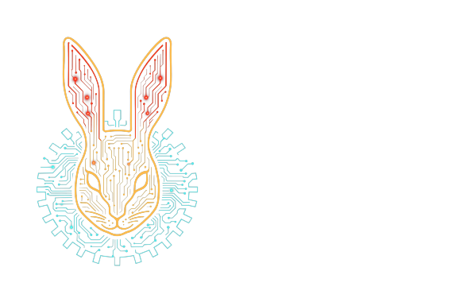

# kotlin-exec



<p align=center>
    
    
</p>

`kotlin-exec` is a Kotlin process execution library for JVM projects that need bounded output
capture, explicit environment handling, structured failures, and clear ownership of child process
lifecycle.

It exposes two execution styles:

- Managed execution with `Exec.exec` or `Exec.execBlocking`, where `kotlin-exec` starts the process,
  owns stdin/stdout/stderr pumping, waits for completion, enforces timeouts, and returns `ExecResult`
  or throws `ExecException`.
- Spawned execution with `Exec.spawn` or `Exec.spawnBlocking`, where the caller receives a
  `RunningProcess` handle and owns any later waiting or termination.

The public API is split between portable `ExecSpec`/`SpawnSpec` models and JVM-specific opt-in APIs
for `java.nio.file.Path`, `InputStream`, `OutputStream`, `Charset`, raw `Process` access, and
virtual-thread selection.

## 🚀 Installation

```kotlin
repositories {
    mavenCentral()
}

dependencies {
    implementation("one.wabbit:kotlin-exec:0.0.1")
}
```

`kotlin-exec` currently publishes a JVM artifact and uses a JDK 21 toolchain.

## 🚀 Usage

```kotlin
import one.wabbit.exec.Exec
import one.wabbit.exec.ExecSpec

val result = Exec.execBlocking(
    ExecSpec.tooling(
        argv = listOf("sh", "-c", "printf 'hello\\n'")
    )
)

check(result.ok)
check(result.stdout?.text() == "hello")
```

Commands are passed directly to the process launcher. `kotlin-exec` does not insert a shell. Use
`sh -c`, `cmd /c`, or another shell explicitly when shell parsing is part of the command you want.

## Managed Execution

Managed execution is the right default for foreground tools:

```kotlin
import one.wabbit.exec.Exec
import one.wabbit.exec.ExecSpec
import one.wabbit.exec.ExitPolicy
import kotlin.time.Duration.Companion.seconds

val result = Exec.execBlocking(
    ExecSpec.tooling(
        argv = listOf("git", "status", "--short"),
        timeout = 10.seconds,
        exitPolicy = ExitPolicy.ThrowOnNonZero
    )
)

println(result.stdout?.text())
```

If a managed run times out, is cancelled, exceeds a hard output limit, or fails during I/O, the
library terminates the process tree according to the configured `ShutdownPolicy`.

Use `Exec.execOutcome` or `Exec.execBlockingOutcome` when a call site wants an explicit
`ExecOutcome.Success` or `ExecOutcome.Failure` value instead of catching `ExecException` for ordinary
execution failures.

## Output Capture

The raw `ExecSpec` constructor defaults capture:

- stdout head, up to 4 MiB
- stderr tail, up to 256 KiB

`ExecSpec.tooling` also captures stdout head up to 4 MiB, but keeps a larger stderr tail of 1 MiB by
default because tool diagnostics are commonly emitted on stderr.

Use explicit sinks when you need different behavior:

```kotlin
import one.wabbit.exec.ExecSpec

val spec = ExecSpec(
    argv = listOf("my-tool"),
    stdout = ExecSpec.StdoutSpec.Pipe(
        ExecSpec.SinkSpec.Capture(
            maxBytes = 1024 * 1024,
            keep = ExecSpec.Keep.Tail
        )
    ),
    stderr = ExecSpec.StderrSpec.Pipe(
        ExecSpec.SinkSpec.File(
            path = kotlinx.io.files.Path("tool.err")
        )
    )
)
```

`SinkSpec.WriteTo` streams output into a caller-supplied `kotlinx.io.Sink`. Use it when the receiving
side already owns the sink lifecycle and should not be represented as a file path.

Capture limits are byte limits. With `DrainAndTruncate`, `kotlin-exec` keeps reading output but stops
retaining bytes past the limit. With `KillProcess`, exceeding the limit terminates the process and
reports `ExecError.OutputLimitExceeded`.

## Environment Policy

`EnvPolicy.Inherit` preserves the parent environment and applies an overlay.

`EnvPolicy.Hermetic` clears the parent environment, installs a minimal platform environment, and
applies the supplied map.

`EnvPolicy.ClearAndSet` clears the parent environment and uses exactly the supplied map. Use it only
when the launched command can run without helper variables such as `PATH`.

## Spawned Processes

Use spawn when the child should outlive the initial call or when timeout should not kill it:

```kotlin
import one.wabbit.exec.Exec
import one.wabbit.exec.SpawnSpec
import kotlin.time.Duration.Companion.seconds

val process = Exec.spawnBlocking(
    SpawnSpec(argv = listOf("sleep", "30"))
)

val exit = process.awaitExitBlocking(timeout = 1.seconds)
check(exit == null)

process.killTree()
```

`awaitExitBlocking` and `awaitExit` are non-destructive. If they time out, the process may still be
running.

## JVM-Specific APIs

JVM-only APIs are marked with `@PlatformSpecificExecApi`. Opt in when you need:

- `java.nio.file.Path` instead of `kotlinx.io.files.Path`
- stdin from `InputStream` or `OutputStream` callbacks
- charset-specific text input or decoding
- raw `Process` access through `JvmRunningProcess`
- explicit `VirtualThreadsPolicy` for blocking execution

Prefer the portable common model unless the JVM-specific feature is required.

## Documentation

- [User guide](docs/user-guide.md)
- [API reference notes](docs/api-reference.md)
- [Troubleshooting](docs/troubleshooting.md)
- [Development](docs/development.md)

Generated API docs can be built locally with Dokka. See [API reference notes](docs/api-reference.md)
for the command.

## Design Notes

- [Non-destructive timeout design gap](TRY_REMOTE_ISSUE.md): internal design record for the hybrid
  case where callers want managed capture but a timeout should leave the process alive.
- [Native launcher design notes](ZIG_EXEC_LAUNCHER.md): design sketch for a possible native launcher
  helper; it is not required for the current JVM API.

## Release Notes

- [CHANGELOG.md](CHANGELOG.md)

## Licensing

This project is licensed under the GNU Affero General Public License v3.0 (AGPL-3.0) for open source
use.

For commercial use, contact Wabbit Consulting Corporation at `wabbit@wabbit.one`.

## Contributing

Before contributions can be merged, contributors need to agree to the repository CLA.
